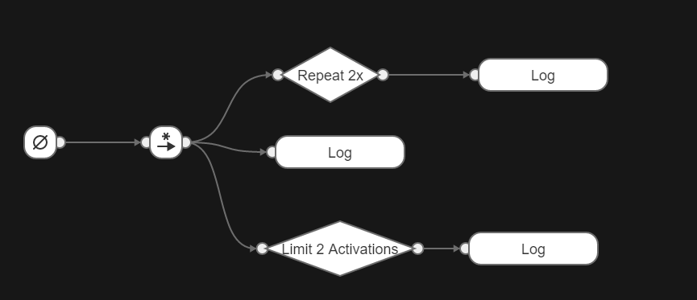

# behavior3java [](https://travis-ci.org/SilenceSu/behavior3java) [](https://search.maven.org/search?q=behavior3java)


### Overview 
    behavior3java是一套与behavior3editor编辑器相配套的行为树框架。

### 编辑器
- https://github.com/behavior3/behavior3editor  源码
- https://github.com/magicsea/behavior3editor/releases 桌面版本


### 开始使用


##### 注意点
使用桌面版本时候会出现b3文件，代表整个工程文件。
但是此时工程文件与导出project json 格式是不一样的。
所以导致报错不兼容，后期会区分加载b3文件与工程json

##### 引用框架
```
<dependency>
  <groupId>com.github.silencesu</groupId>
  <artifactId>behavior3java</artifactId>
  <version>1.1.0</version>
</dependency>

```

##### 独立子树加载

```

//不包含子树的独立树
BehaviorTree behaviorTree = B3Loader.loadB3Tree(confJson, extendNodes);
```

##### 含有子树的工程加载

```
//加载整个工程文件
BehaviorTreeProject behaviorTreeProject = B3Loader.loadB3Project(confJson, extendNodes);
BehaviorTree behaviorTree = behaviorTreeProject.findBTTreeByTitle("b1");//获取名字为b1的树

```

##### 开始运行
```
//该行为树所有数据都存储在blackboard中。
Blackboard blackboard = new Blackboard();
//驱动tick
behaviorTree.tick(new Object(), blackboard);

```

 
### 测试用例行为树

- ### 行为树b1



- ### 行为树b2


# 行为树介绍
### 行为树 4大基本类型节点

- Composite  Node   组合节点
- Decorator  Node   修饰节点
- Condition  Node   条件节点(叶节点)
- Action     Node   动作节点(叶节点)


###  行为树节点状态

- SUCCESS 节点执行成功
- FAILED  节点失败
- RUNNING 节点正在运行
- ERROR   程序错误


#### Composite 节点子类

- Priorty(Selector) Node   选择节点

>当执行本类型Node时，它将从begin到end迭代执行自己的Child Node：
如遇到一个Child Node执行后返回True，那停止迭代，
本Node向自己的Parent Node也返回True；否则所有Child Node都返回False，
那本Node向自己的Parent Node返回False。


- Sequence Node   顺序节点

>当执行本类型Node时，它将从begin到end迭代执行自己的Child Node：
如遇到一个Child Node执行后返回False，那停止迭代，
本Node向自己的Parent Node也返回False；否则所有Child Node都返回True，
那本Node向自己的Parent Node返回True。

 

- Parallel Node   (计划)

>并发执行它的所有Child Node。
而向Parent Node返回的值和Parallel Node所采取的具体策略相关：
Parallel Selector Node: 一False则返回False，全True才返回True。
Parallel Sequence Node: 一True则返回True，全False才返回False。
Parallel Hybird Node: 指定数量的Child Node返回True或False后才决定结果。

- Random 随机节点  （计划）

>随机的执行节点


#### Decorator 节点常用
- Inverter
- Limiter
- MaxTime
- Repeater
- RepeatUntilFailure
- RepeatUntilSuccess

#### Action 节点

- Succeeder
- Failer
- Error
- Runner
- Wait


#

### 行为树相关学习
- http://www.aisharing.com/archives/90#comment-238610
- https://www.behaviac.com/concepts/
- https://note.youdao.com/ynoteshare1/index.html?id=4f46dc2144ea62b55f597630f5e666b4&type=note

### 相关项目
- https://github.com/magicsea/behavior3go
- https://github.com/behavior3/behavior3js
- https://github.com/behavior3/behavior3py
